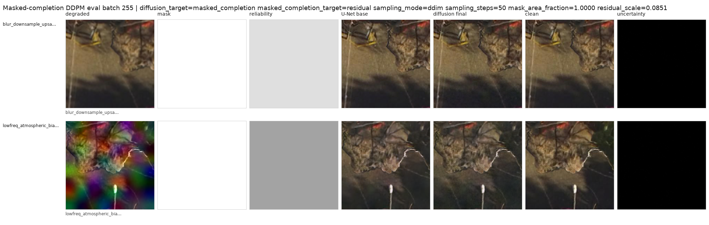
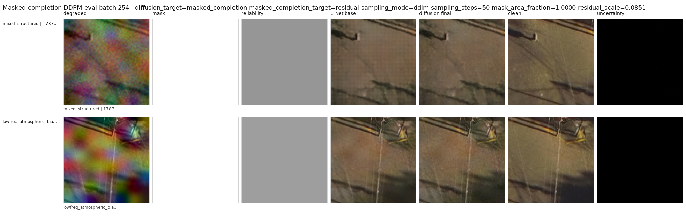
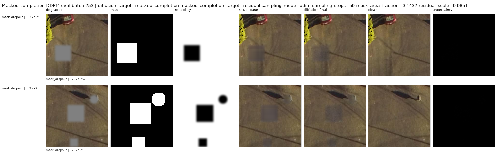
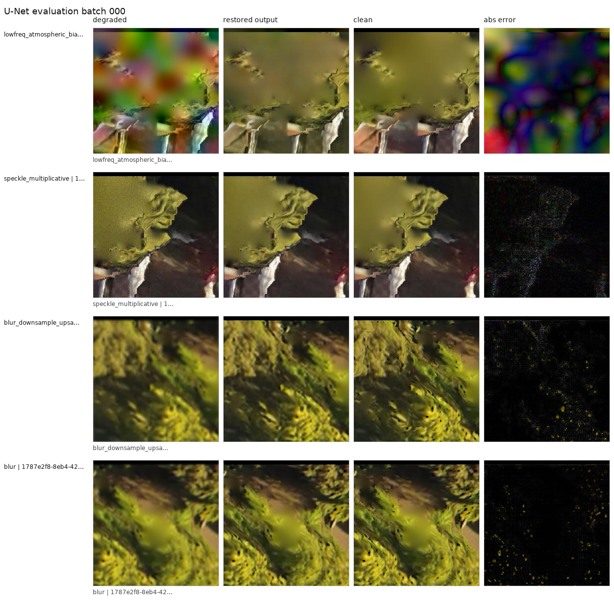
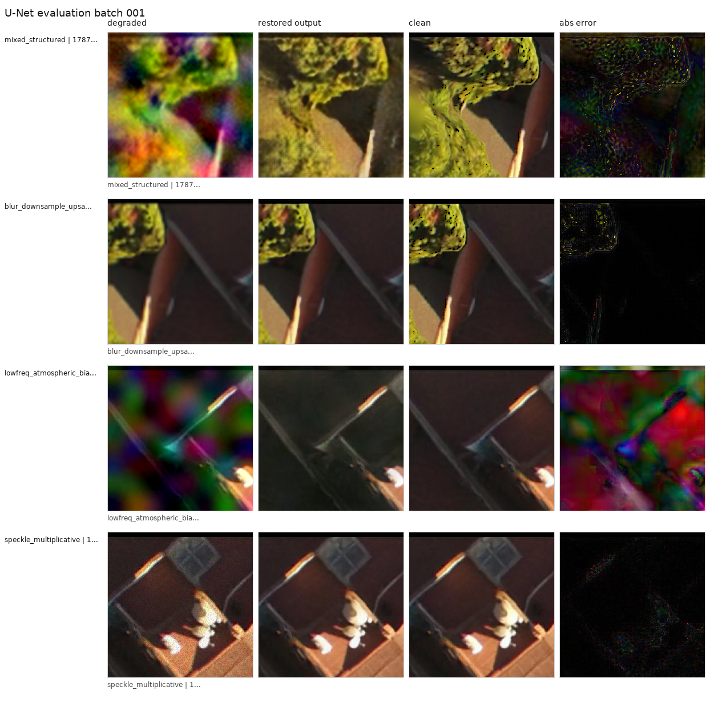

# Sky_SR: Satellite Image Restoration Experiments

Sky_SR is a research sandbox for learning how to restore degraded satellite
image patches. The project builds RGB Earth-imagery patch datasets, applies
controlled synthetic degradations, trains restoration models, and evaluates the
results with both image grids and quantitative metrics.

The current code focuses on a practical question: when a satellite image has
noise, blur, downsampling artifacts, or missing local regions, how far can a
deterministic U-Net baseline go, and when does a conditional diffusion model
help?

## Latest Visual Outputs

The highlighted examples below come from the actual latest larger experiment
outputs in this repo:

- `sat_denoise_data/outputs/ddpm_masked_completion_hard_10k_eval_ddim`
- `sat_denoise_data/outputs/unet_hard_50k_b6w8_eval`

The masked-completion DDPM grids show the full restoration path:

`degraded | mask | reliability | U-Net base | diffusion final | clean | uncertainty`

The white mask marks where DDPM completion is allowed. The evaluation verifies
that the diffusion stage leaves pixels outside that region unchanged.







The U-Net eval grids show the deterministic restoration baseline:

`degraded | restored | clean | abs error`





## Current Result Snapshot

Hard U-Net eval on `unet_hard_50k_b6w8_eval`:

| Metric | Degraded input | U-Net restored | Change |
| --- | ---: | ---: | ---: |
| PSNR | 24.94 | 32.21 | +7.26 |
| MAE | 0.0487 | 0.0207 | -0.0280 |
| SSIM | 0.6898 | 0.8948 | +0.2051 |

Masked-completion DDPM eval on `ddpm_masked_completion_hard_10k_eval_ddim`:

| Metric | Degraded input | U-Net base | Diffusion final |
| --- | ---: | ---: | ---: |
| PSNR | 25.31 | 30.96 | 30.41 |
| MAE | 0.0466 | 0.0223 | 0.0238 |
| SSIM | 0.7785 | 0.9087 | 0.8891 |

Additional checks from the same run:

- Evaluation mode: `masked_completion`
- Degradation types: `mixed_structured`, `blur_downsample_upsample`,
  `lowfreq_atmospheric_bias`, `mask_dropout`
- Mean mask area: `89.14%`
- Samples evaluated: `512`
- Sampler: `ddim`
- Diffusion samples per input: `4`
- Outside-mask maximum difference: `0.0`

The important interpretation is that the masked DDPM path is spatially safe in
this run: it does not alter pixels outside the allowed mask. The U-Net base
remains the stronger global reconstruction baseline on this paired RGB
benchmark, while DDPM is useful as a constrained completion experiment.

## How It Works

The project pipeline has four stages.

1. Build image patches from open Earth imagery.
   Source GeoTIFF, TIFF, PNG, and JPG files are cut into 256 x 256 RGB patches.
   The manifest records the patch path, source image, pixel window, and
   geospatial metadata when available.

2. Apply synthetic degradations.
   The training dataset creates paired examples from clean patches. Supported
   degradations include Gaussian noise, speckle, blur, downsample/upsample
   artifacts, structured hard degradations, and localized mask dropout.

3. Train restoration models.
   The main deterministic baseline is a residual U-Net that predicts a
   correction to add back to the degraded image. The diffusion variants are
   conditional DDPM models that can predict either a clean target or a residual
   target, optionally using masks and reliability maps as conditioning inputs.

4. Evaluate and save diagnostics.
   Evaluation writes metric JSON files and labeled image grids. The grids are
   meant to make failures obvious: they show the degraded input, masks,
   reliability, model outputs, clean target, and uncertainty where applicable.

## Model Families

This repository includes code for:

- `ResidualUNet`: deterministic residual restoration baseline.
- `DDPMUNet`: conditional diffusion U-Net.
- Full-image conditional DDPM: predicts clean RGB images from degraded inputs.
- Residual-DDPM refinement: predicts a residual on top of a frozen U-Net base.
- Gated residual-DDPM: limits where sampled diffusion residuals can change the image.
- Masked-completion DDPM: only completes regions selected by a degradation mask.

The strongest result so far on the paired RGB proxy benchmark is the
deterministic hard U-Net baseline. Diffusion is currently most useful as an
experimental masked or gated completion module, not as the primary restoration
model.

## Repository Layout

```text
sat_denoise_data/
  configs/                 Training configs for U-Net and DDPM variants
  data/                    Local imagery, patches, and manifests
  docs/                    Experiment notes
  outputs/                 Local training/evaluation artifacts
  src/
    data/                  Patch degradation dataset
    download/              Open imagery download helpers
    evaluation/            U-Net and DDPM evaluators
    models/                U-Net and diffusion model definitions
    processing/            Patch builders and preview tools
    training/              Training entrypoints
    utils/                 Metrics, checkpoints, grids, gates, seeds
```

`data/`, `outputs/`, and model checkpoints are intentionally gitignored because
they can be large. The selected images shown in this README are copied from the
actual output directories into `docs/assets/` so they render on GitHub.

## Setup

From the repository root:

```bash
cd sat_denoise_data
python -m venv .venv
source .venv/bin/activate
pip install -r requirements.txt
pip install torch torchvision
```

`rasterio` is used for GeoTIFF handling. If you only work with PNG/JPG inputs,
the image loading path can fall back to PIL for non-geospatial images.

## Build A Patch Dataset

Place source imagery under `sat_denoise_data/data/raw/`, then inspect it:

```bash
python -m src.processing.inspect_images --input_dir data/raw
```

Build a source-balanced patch dataset:

```bash
python -m src.processing.build_patch_dataset \
  --input_dir data/raw \
  --output_dir data/patches \
  --manifest data/manifests/patches.jsonl \
  --patch_size 256 \
  --stride 256 \
  --max_patches 1000 \
  --max_patches_per_source 125 \
  --rgb_only \
  --skip_blank \
  --resume
```

Create quick visual checks:

```bash
python -m src.processing.make_preview_grid \
  --patch_dir data/patches \
  --output data/previews/patch_grid.png \
  --num_images 64

python -m src.processing.make_degradation_preview \
  --patch_dir data/patches \
  --output data/previews/degradation_grid.png
```

## Train A U-Net Baseline

```bash
python -m src.training.train_unet_denoiser \
  --config configs/train_unet_denoiser.yaml
```

Evaluate it:

```bash
python -m src.evaluation.eval_unet_denoiser \
  --ckpt outputs/unet_smoke/ckpt_best.pt \
  --manifest data/manifests/patches.jsonl \
  --patch_dir data/patches \
  --output_dir outputs/unet_eval \
  --max_samples 32
```

## Train A Masked-Completion DDPM

The hard masked-completion configuration uses a frozen U-Net base,
conditions the DDPM on the degraded image, base restoration, degradation mask,
and reliability map, then composes the final output only inside the mask.

```bash
python -m src.training.train_ddpm_denoiser \
  --config configs/train_ddpm_masked_completion_hard.yaml
```

Evaluate it:

```bash
python -m src.evaluation.eval_ddpm_denoiser \
  --ckpt outputs/ddpm_masked_completion_hard_10k/ckpt_best.pt \
  --base_ckpt outputs/unet_hard_50k_b6w8/ckpt_best.pt \
  --manifest data/manifests/patches_diverse.jsonl \
  --patch_dir data/patches_diverse \
  --output_dir outputs/ddpm_masked_completion_hard_10k_eval_ddim \
  --max_samples 512 \
  --sampling_mode ddim \
  --sampling_steps 50 \
  --num_samples_per_input 4
```

## Notes For Public Use

- This repo does not include the full local dataset, trained checkpoints, or
  large generated outputs.
- Use imagery that you have permission to download, process, and redistribute.
- Metrics in this README are from smoke-scale/local experiments, not a final
  benchmark claim.
- The RGB dataset is a proxy for restoration research. It is useful for testing
  architectures and diagnostics before moving to more specialized remote-sensing
  modalities.
